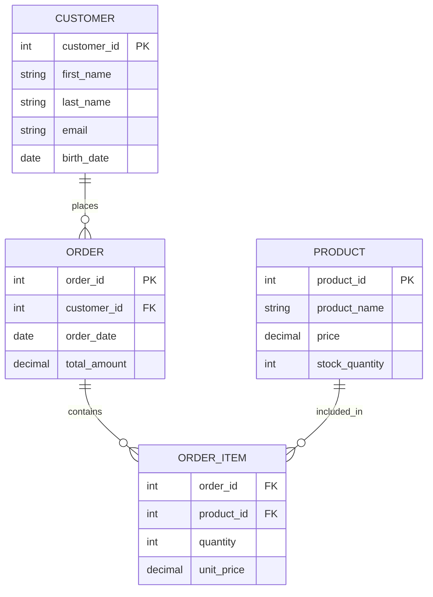
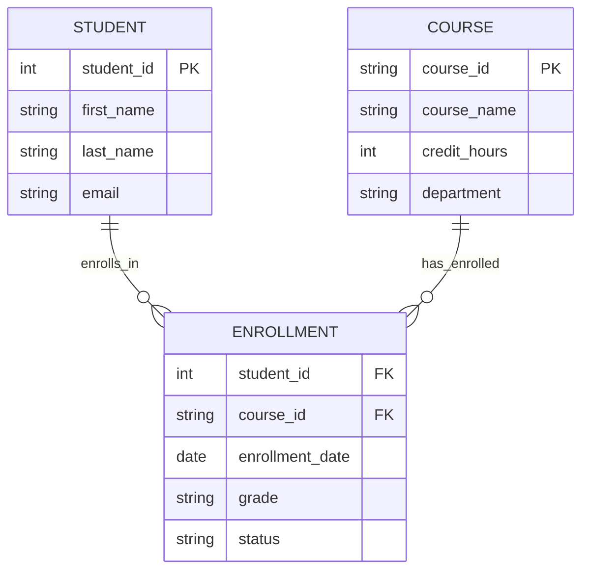

# Database Design Fundamentals - Midterm Study Guide

## Key Terms

- **Entity Relationship Diagram (ERD)**: Visual representation of entities, attributes, and relationships in a database
- **Entity**: A real-world object or concept that can be distinctly identified (e.g., Customer, Product, Order)
- **Attribute**: A property or characteristic of an entity (e.g., CustomerName, ProductPrice)
- **Relationship**: An association between two or more entities (e.g., Customer places Order)
- **Cardinality**: Describes the numerical relationship between entity instances (1:1, 1:M, M:N)
- **Primary Key**: Unique identifier for each entity instance
- **Foreign Key**: Attribute that references the primary key of another entity
- **Hierarchical Design**: Organizing entities in parent-child relationships with inheritance
- **Normalization**: Process of organizing data to reduce redundancy and improve data integrity
- **Functional Dependency**: When one attribute determines the value of another attribute
- **First Normal Form (1NF)**: Eliminates repeating groups and ensures atomic values
- **Second Normal Form (2NF)**: Achieves 1NF and eliminates partial dependencies
- **Third Normal Form (3NF)**: Achieves 2NF and eliminates transitive dependencies

## Part I: Midterm Exam Content Coverage

### 1. Entity Relationship Diagrams (ERD)

**Core Concepts You Must Know:**

<details>
<summary><strong>Entity Types and Attributes</strong></summary>

- **Strong Entities**: Independent entities with their own primary key
- **Weak Entities**: Dependent on strong entities for identification
- **Attribute Types**: Simple, composite, multivalued, derived, key attributes

</details>

<details>
<summary><strong>Relationship Types and Cardinality</strong></summary>

- **One-to-One (1:1)**: Each entity instance relates to exactly one instance of another entity
- **One-to-Many (1:M)**: One entity instance relates to multiple instances of another entity
- **Many-to-Many (M:N)**: Multiple instances of each entity can relate to multiple instances of the other

</details>

<details>
<summary><strong>ERD Notation and Symbols</strong></summary>


This ERD shows a classic e-commerce scenario with proper entity relationships. The Customer entity has a one-to-many relationship with Order (one customer can place multiple orders). The many-to-many relationship between Order and Product is resolved through the ORDER_ITEM associative entity, which also stores additional attributes like quantity and unit_price specific to each order line item.

</details>

### 2. Hierarchical Entity Design

**Inheritance and Specialization Concepts:**

<details>
<summary><strong>Supertype/Subtype Relationships</strong></summary>

- **Supertype**: General entity containing common attributes
- **Subtypes**: Specialized entities inheriting from supertype with additional specific attributes
- **Disjoint vs. Overlapping**: Whether an instance can belong to multiple subtypes
- **Complete vs. Incomplete**: Whether all supertype instances must belong to a subtype

</details>

<details>
<summary><strong>Example: Employee Hierarchy</strong></summary>
```mermaid
erDiagram
    EMPLOYEE {
        int employee_id PK
        string first_name
        string last_name
        date hire_date
        decimal base_salary
        string employee_type
    }
    
    MANAGER {
        int employee_id PK FK
        decimal bonus_percentage
        int department_id
    }
    
    SALESPERSON {
        int employee_id PK FK
        decimal commission_rate
        string territory
    }
    
    DEVELOPER {
        int employee_id PK FK
        string programming_language
        string certification_level
    }
    
    EMPLOYEE ||--o| MANAGER : "is_a"
    EMPLOYEE ||--o| SALESPERSON : "is_a"
    EMPLOYEE ||--o| DEVELOPER : "is_a"
```

This diagram demonstrates hierarchical entity design where EMPLOYEE is the supertype containing common attributes, while MANAGER, SALESPERSON, and DEVELOPER are subtypes with specialized attributes. This design follows the principle that each subtype inherits all attributes from the supertype while adding its own specific attributes.

</details>

### 3. Normalization: 1NF through 3NF

**The Systematic Process of Eliminating Data Anomalies:**

<details>
<summary><strong>Unnormalized Data Example</strong></summary>

Consider this poorly designed student course table:

| StudentID | StudentName | CourseList | Instructor | Department |
|-----------|-------------|------------|------------|------------|
| 001 | John Smith | CS101, CS102, MATH201 | Dr. Johnson, Dr. Lee, Dr. Brown | Computer Science, Computer Science, Mathematics |
| 002 | Jane Doe | CS101, PHYS101 | Dr. Johnson, Dr. White | Computer Science, Physics |

**Problems:**
- Repeating groups (multiple courses per student)
- Non-atomic values (comma-separated lists)
- Update anomalies (changing instructor name requires multiple updates)
- Insertion anomalies (can't add new course without student)
- Deletion anomalies (removing last student removes course information)

</details>

<details>
<summary><strong>First Normal Form (1NF)</strong></summary>

**Rule**: Eliminate repeating groups and ensure all attribute values are atomic.

**1NF Result:**
| StudentID | StudentName | CourseID | Instructor | Department |
|-----------|-------------|----------|------------|------------|
| 001 | John Smith | CS101 | Dr. Johnson | Computer Science |
| 001 | John Smith | CS102 | Dr. Lee | Computer Science |
| 001 | John Smith | MATH201 | Dr. Brown | Mathematics |
| 002 | Jane Doe | CS101 | Dr. Johnson | Computer Science |
| 002 | Jane Doe | PHYS101 | Dr. White | Physics |

</details>

<details>
<summary><strong>Second Normal Form (2NF)</strong></summary>

**Rule**: Must be in 1NF AND eliminate partial dependencies (non-key attributes depending on part of a composite key).

**Composite Key**: (StudentID, CourseID)
**Partial Dependencies Identified:**
- StudentName depends only on StudentID (not CourseID)
- Instructor depends only on CourseID (not StudentID)
- Department depends only on CourseID (not StudentID)

**2NF Result:**

**STUDENT Table:**
| StudentID | StudentName |
|-----------|-------------|
| 001 | John Smith |
| 002 | Jane Doe |

**COURSE Table:**
| CourseID | Instructor | Department |
|----------|------------|------------|
| CS101 | Dr. Johnson | Computer Science |
| CS102 | Dr. Lee | Computer Science |
| MATH201 | Dr. Brown | Mathematics |
| PHYS101 | Dr. White | Physics |

**ENROLLMENT Table:**
| StudentID | CourseID |
|-----------|----------|
| 001 | CS101 |
| 001 | CS102 |
| 001 | MATH201 |
| 002 | CS101 |
| 002 | PHYS101 |

</details>

<details>
<summary><strong>Third Normal Form (3NF)</strong></summary>

**Rule**: Must be in 2NF AND eliminate transitive dependencies (non-key attributes depending on other non-key attributes).

**Transitive Dependency Identified:**
- In COURSE table: Department depends on Instructor (not directly on CourseID)

**3NF Result:**

**STUDENT Table:** (unchanged)
| StudentID | StudentName |
|-----------|-------------|
| 001 | John Smith |
| 002 | Jane Doe |

**INSTRUCTOR Table:**
| InstructorID | InstructorName | Department |
|--------------|----------------|------------|
| I001 | Dr. Johnson | Computer Science |
| I002 | Dr. Lee | Computer Science |
| I003 | Dr. Brown | Mathematics |
| I004 | Dr. White | Physics |

**COURSE Table:**
| CourseID | InstructorID |
|----------|--------------|
| CS101 | I001 |
| CS102 | I002 |
| MATH201 | I003 |
| PHYS101 | I004 |

**ENROLLMENT Table:** (unchanged)
| StudentID | CourseID |
|-----------|----------|
| 001 | CS101 |
| 001 | CS102 |
| 001 | MATH201 |
| 002 | CS101 |
| 002 | PHYS101 |

</details>

### 4. Composite Keys and Junction Tables

**Understanding Multi-Column Primary Keys:**

#### What is a Composite Key?
A **composite key** is a primary key consisting of two or more columns that together uniquely identify each row in a table. This is especially common in junction tables that resolve many-to-many relationships.

#### Junction Tables and Foreign Key Combinations

When resolving many-to-many relationships, junction tables often use composite keys made up of foreign keys from the related entities.

**Example: Student-Course Enrollment**



This diagram shows how a junction table (ENROLLMENT) resolves the many-to-many relationship between STUDENT and COURSE. The composite key (student_id, course_id) ensures that each student can only be enrolled once in each specific course, while still allowing multiple enrollments across different courses and semesters.

**Key Principles:**

<details>
<summary><strong>Composite Key Formation</strong></summary>

- **Primary Key**: (student_id, course_id) together form the composite primary key
- **Uniqueness**: No student can be enrolled in the same course more than once
- **Foreign Key Constraint**: Each part of the composite key references a primary key in another table
- **Additional Attributes**: enrollment_date, grade, and status provide information specific to this enrollment relationship

</details>

<details>
<summary><strong>Why Not Add a Surrogate Key?</strong></summary>

**Option 1: Natural Composite Key (Recommended)**
```sql
CREATE TABLE enrollment (
    student_id INT,
    course_id VARCHAR(10),
    enrollment_date DATE,
    grade CHAR(2),
    status VARCHAR(20),
    PRIMARY KEY (student_id, course_id),
    FOREIGN KEY (student_id) REFERENCES student(student_id),
    FOREIGN KEY (course_id) REFERENCES course(course_id)
);
```

**Option 2: Surrogate Key + Unique Constraint**
```sql
CREATE TABLE enrollment (
    enrollment_id INT AUTO_INCREMENT PRIMARY KEY,
    student_id INT,
    course_id VARCHAR(10),
    enrollment_date DATE,
    grade CHAR(2),
    status VARCHAR(20),
    UNIQUE KEY unique_enrollment (student_id, course_id),
    FOREIGN KEY (student_id) REFERENCES student(student_id),
    FOREIGN KEY (course_id) REFERENCES course(course_id)
);
```

**Why Option 1 is Often Better:**
- **Simpler**: No unnecessary surrogate key
- **Natural**: The business meaning is clear from the key itself
- **Efficient**: Fewer columns and indexes needed
- **Logical**: The combination naturally represents the relationship

</details>

<details>
<summary><strong>When to Use Surrogate Keys in Junction Tables</strong></summary>

Consider adding a surrogate key when:
- **Referential Integrity**: Other tables need to reference specific enrollment records
- **Audit Trail**: You need to track changes to enrollment records over time
- **Performance**: The composite key becomes too large for efficient indexing
- **Framework Requirements**: Your ORM or application framework expects single-column primary keys

**Example with Referenced Junction Table:**
```sql
-- ENROLLMENT table with surrogate key
CREATE TABLE enrollment (
    enrollment_id INT AUTO_INCREMENT PRIMARY KEY,
    student_id INT,
    course_id VARCHAR(10),
    semester VARCHAR(20),
    -- other enrollment attributes
);

-- GRADE_HISTORY references specific enrollments
CREATE TABLE grade_history (
    grade_history_id INT AUTO_INCREMENT PRIMARY KEY,
    enrollment_id INT,
    grade CHAR(2),
    grade_date DATE,
    comments TEXT,
    FOREIGN KEY (enrollment_id) REFERENCES enrollment(enrollment_id)
);
```

</details>

## Part II: Practice Problems and Exam Preparation

### ERD Design Problems

#### Problem 1: Library Management System
**Scenario**: Design an ERD for a library system tracking books, authors, members, and borrowing transactions.

**Requirements:**
- Books have ISBN, title, publication year, and genre
- Authors have author ID, name, and biography
- Books can have multiple authors; authors can write multiple books
- Members have member ID, name, address, and phone
- Track borrowing with due dates and return dates
- Members can borrow multiple books; books can be borrowed by multiple members over time

**Key Learning Objectives:**
- Identify entities and attributes
- Determine relationship cardinalities
- Resolve many-to-many relationships
- Handle temporal data (borrowing history)

#### Problem 2: Hospital Management System
**Scenario**: Design an ERD for a hospital tracking patients, doctors, appointments, and treatments.

**Requirements:**
- Patients have patient ID, name, date of birth, insurance information
- Doctors have doctor ID, name, specialization, department
- Appointments link patients and doctors with date/time
- Treatments are prescribed during appointments
- Track medication with dosage and frequency
- Handle doctor-patient relationships and treatment history

### Hierarchical Design Problems

#### Problem 3: Vehicle Fleet Management
**Scenario**: Design a hierarchical entity structure for a vehicle fleet management system.

**Requirements:**
- All vehicles have VIN, make, model, year, license plate
- Cars have number of doors, fuel type
- Trucks have cargo capacity, number of axles
- Motorcycles have engine size, type (sport/touring/cruiser)
- Service records apply to all vehicle types
- Insurance varies by vehicle type

**Practice Questions:**
1. Identify the supertype and subtypes
2. Determine which attributes belong to supertype vs. subtypes
3. Decide on disjoint vs. overlapping constraints
4. Design the inheritance mapping strategy

#### Problem 4: Financial Institution Accounts
**Scenario**: Design a hierarchical entity structure for a bank's account management system.

**Requirements:**
- All accounts have account_number, balance, date_opened, customer_id
- Checking accounts have overdraft_limit, monthly_fee, minimum_balance
- Savings accounts have interest_rate, withdrawal_limit_per_month
- Certificate of Deposit (CD) accounts have maturity_date, penalty_rate, initial_deposit
- Credit card accounts have credit_limit, APR, payment_due_date
- Business accounts can be either checking or savings with additional tax_id, business_name
- Some customers may have multiple account types

**Practice Questions:**
1. Design the supertype/subtype hierarchy
2. Handle the business account requirements (overlapping inheritance)
3. Determine if constraints are disjoint or overlapping
4. Consider how to handle customers with multiple account types

#### Problem 5: Educational Institution Personnel
**Scenario**: Design a hierarchical entity structure for university personnel management.

**Requirements:**
- All personnel have employee_id, name, hire_date, salary, department
- Faculty have rank (assistant, associate, full professor), tenure_status, research_area
- Administrative staff have job_title, clearance_level
- Support staff have union_membership, hourly_wage (instead of salary)
- Graduate students can be teaching assistants with stipend, course_assignments
- Some faculty also have administrative roles (e.g., department chair)
- Adjunct faculty are part-time with course_load, per_course_rate

**Practice Questions:**
1. Identify complex inheritance relationships
2. Handle dual roles (faculty with administrative duties)
3. Design overlapping vs. disjoint constraints
4. Consider salary vs. hourly wage vs. stipend variations

#### Problem 6: Media Content Management
**Scenario**: Design a hierarchical entity structure for a digital media platform.

**Requirements:**
- All content has content_id, title, upload_date, creator_id, file_size
- Videos have duration, resolution, format, thumbnail_url
- Audio files have duration, bitrate, genre, album_info
- Images have dimensions, color_depth, camera_info
- Documents have page_count, format (PDF, DOC, etc.), language
- Live streams have start_time, viewer_count, stream_quality
- Some content can be part of series/collections
- Content can have multiple formats (e.g., video with subtitles as separate documents)

**Practice Questions:**
1. Design the content hierarchy
2. Handle content that exists in multiple formats
3. Consider temporal aspects (live vs. recorded content)
4. Design for content relationships (series, collections)

### Normalization Problems

#### Problem 7: Sales Order Normalization
**Given this unnormalized table:**

| OrderNum | OrderDate | CustomerName | CustomerAddr | ProductID | ProductName | Quantity | UnitPrice | SalespersonName | Commission |
|----------|-----------|--------------|--------------|-----------|-------------|----------|-----------|-----------------|------------|
| 1001 | 2024-01-15 | ABC Corp | 123 Main St | P001, P002 | Widget A, Widget B | 10, 5 | 25.00, 45.00 | John Sales | 0.05 |

**Tasks:**
1. Convert to 1NF
2. Identify functional dependencies
3. Convert to 2NF
4. Convert to 3NF
5. Draw the final ERD

#### Problem 8: Course Registration Normalization
**Given this student-course registration data, normalize through 3NF:**

| StudentID | StudentName | Major | AdvisorName | AdvisorOffice | CourseID | CourseName | Credits | Grade | Semester |
|-----------|-------------|-------|-------------|---------------|----------|------------|---------|-------|----------|
| S001 | Alice Johnson | CS | Dr. Smith | ENG 201 | CS101, MATH201 | Intro Programming, Calculus I | 3, 4 | A, B+ | Fall 2024, Fall 2024 |

### Exam-Style Questions

#### Conceptual Questions
1. **ERD Analysis**: Given an ERD, identify potential design problems and suggest improvements
2. **Cardinality Justification**: Explain why specific cardinality constraints are appropriate for given business scenarios
3. **Normalization Benefits**: Describe the advantages and potential drawbacks of normalizing to 3NF
4. **Design Trade-offs**: When might you choose to denormalize for performance reasons?

#### Practical Problems
1. **ERD Creation**: Given a business scenario description, create a complete ERD with proper notation
2. **Normalization Steps**: Take unnormalized data through systematic normalization with explanations
3. **Dependency Analysis**: Identify functional dependencies in given data sets
4. **Design Critique**: Evaluate existing database designs and suggest improvements

### Study Strategies

#### What to Focus On
1. **ERD Notation**: Practice drawing ERDs using standard symbols and notation
2. **Relationship Identification**: Learn to distinguish between 1:1, 1:M, and M:N relationships
3. **Normalization Rules**: Memorize the rules for each normal form and practice applying them
4. **Dependency Recognition**: Practice identifying functional dependencies in data sets
5. **Business Rule Translation**: Convert business requirements into database design constraints

#### Common Mistakes to Avoid
1. **Incorrect Cardinality**: Misunderstanding business rules leading to wrong relationship types
2. **Missing Entities**: Failing to identify important real-world objects as separate entities
3. **Normalization Errors**: Stopping normalization too early or normalizing incorrectly
4. **Weak Entity Confusion**: Misidentifying weak entities or their identifying relationships
5. **Attribute Placement**: Putting attributes in wrong entities or creating unnecessary entities

