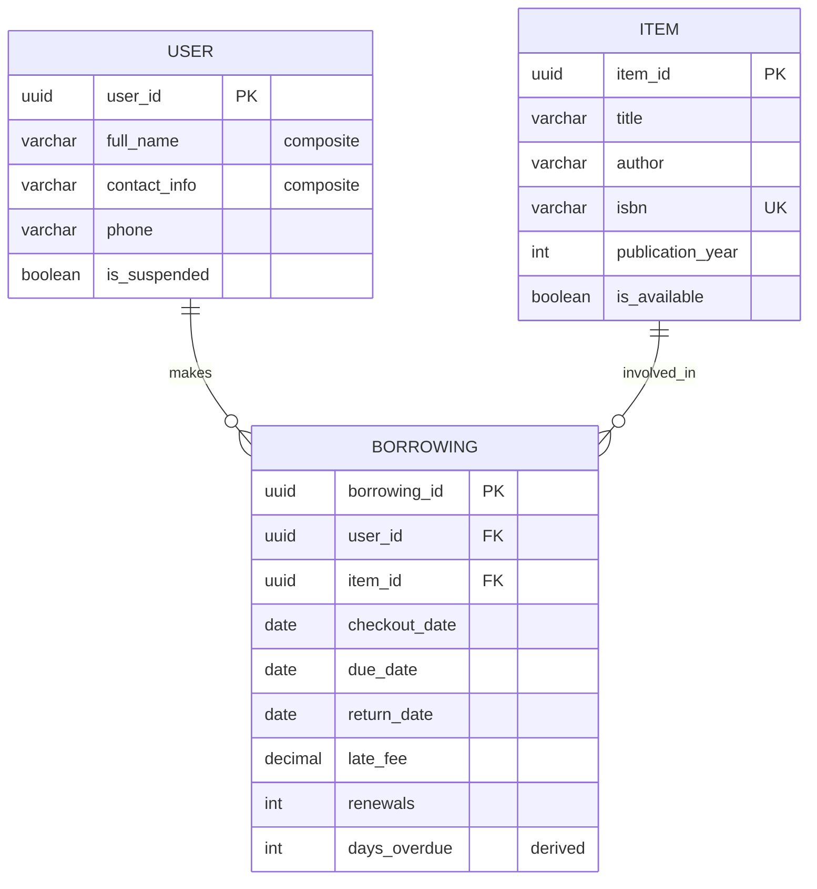
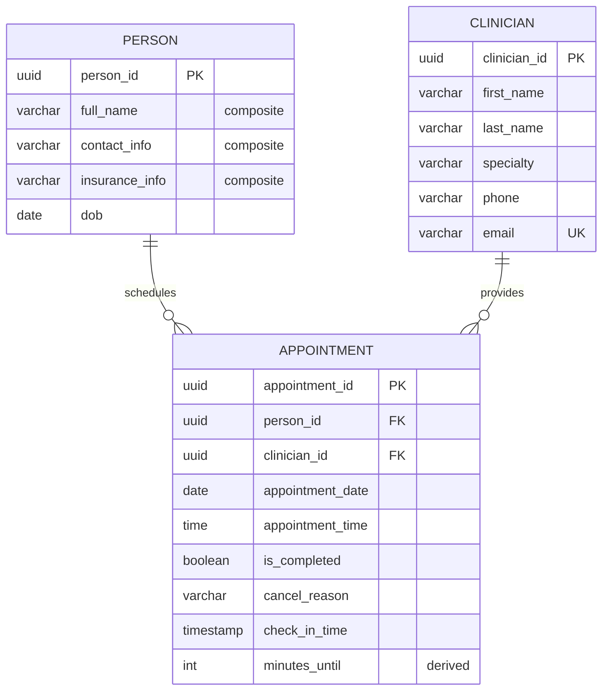

&nbsp;

&nbsp;

&nbsp;

&nbsp;

&nbsp;

&nbsp;

&nbsp;

&nbsp;

&nbsp;

&nbsp;

&nbsp;

&nbsp;

&nbsp;

&nbsp;

&nbsp;

&nbsp;

&nbsp;

&nbsp;

&nbsp;

&nbsp;

&nbsp;

&nbsp;

&nbsp;

&nbsp;

&nbsp;

&nbsp;

&nbsp;

&nbsp;

&nbsp;

&nbsp;

&nbsp;

&nbsp;

&nbsp;

&nbsp;

&nbsp;

&nbsp;

&nbsp;

&nbsp;

&nbsp;

---

# Week 1: ERD Solutions

## Library ERD (3 entities)

**Design assumptions**: This library system operates under several simplifying assumptions based on the assignment requirements. First, the collection maintains only one copy per item, which eliminates the need for a separate copy entity and simplifies inventory management. Each borrowing transaction involves exactly one item, streamlining the checkout process. Late fees are recorded directly on the borrowing record, allowing the system to track financial obligations alongside the lending activity. Users can have their borrowing privileges suspended for unpaid fees, and their contact information can be updated as needed.

**Summary**:

- **entities**: `user`, `item`, `borrowing`
- **PKs**: `user.user_id`, `item.item_id`, `borrowing.borrowing_id`
- **FKs**: `borrowing.user_id` → `user.user_id`, `borrowing.item_id` → `item.item_id`
- **composite attributes**: `user.full_name` (combines first_name + last_name), `user.contact_info` (combines email + address + phone details)
- **derived**: `borrowing.days_overdue` (calculated from due_date and current_date or return_date)

## Clinic ERD (3 entities)

**Design assumptions**: This clinic scheduling system is designed around several key constraints outlined in the assignment. Each appointment connects exactly one person seeking care with one clinician, ensuring clear responsibility and communication. The system schedules appointments for specific calendar days and times, avoiding the complexity of reusable time-slot catalogs. Visit types are intentionally kept out of scope, allowing the system to focus on the core scheduling functionality while remaining flexible for different types of medical visits. The system supports updating patient contact and insurance information, appointment rescheduling, patient check-in tracking, and appointment completion or cancellation with documented reasons.

**Summary**:

- **entities**: `person`, `clinician`, `appointment`
- **PKs**: `person.person_id`, `clinician.clinician_id`, `appointment.appointment_id`
- **FKs**: `appointment.person_id` → `person.person_id`, `appointment.clinician_id` → `clinician.clinician_id`
- **composite attributes**: `person.full_name` (combines first_name + last_name), `person.contact_info` (combines email + phone + address), `person.insurance_info` (combines provider + policy_number + group_id)
- **derived**: `appointment.minutes_until` (calculated from appointment_date + appointment_time and current timestamp)

## Appendix: Data Types

**UUID (Universally Unique Identifier)**: A 128-bit identifier that is virtually guaranteed to be unique across all systems and time. Used for primary keys to ensure global uniqueness and avoid conflicts when merging data from different sources.

**VARCHAR (Variable Character)**: A string data type that can store text of variable length up to a specified maximum. More storage-efficient than fixed-length CHAR types since it only uses space for the actual characters stored.

**Composite Attributes**: Attributes that can be subdivided into smaller sub-attributes. For example, `full_name` combines `first_name` and `last_name`, while `contact_info` combines `email`, `phone`, and `address`. These provide logical grouping while maintaining flexibility in data storage and retrieval.
